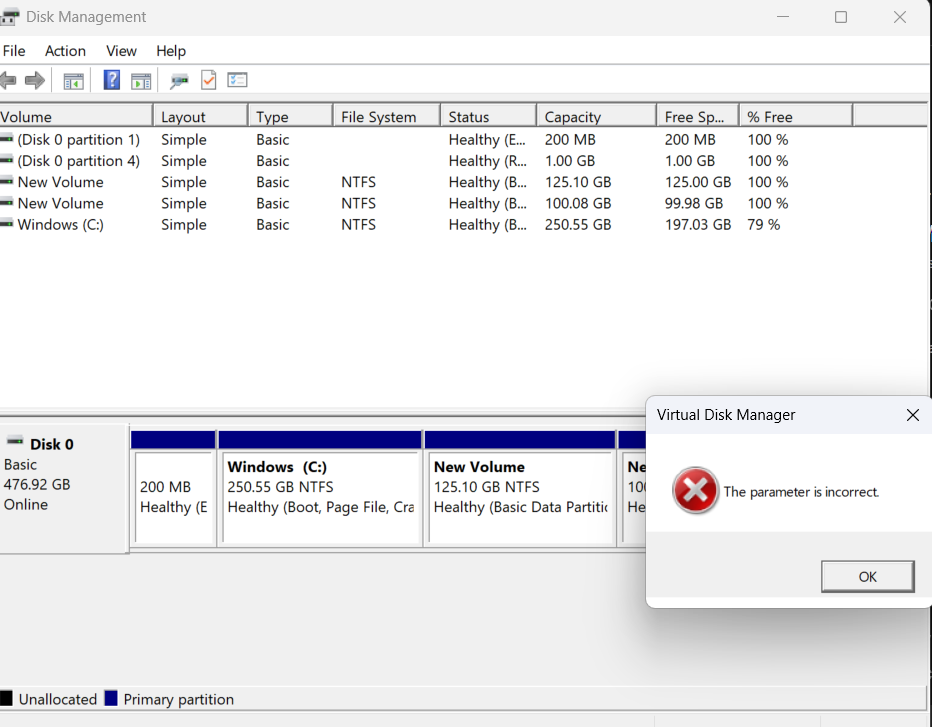

# 🎓 Student Management System in C


A simple **Student Management System** developed using the **C programming language**.

This project was created to practice basic C programming concepts and build a simple menu-driven console application.

---

## 📸 Project Screenshot



---

## ✨ Features

* Add student information
* View student information
* Simple menu-driven system
* User-friendly console interface
* Beginner-friendly C project

---

## 🛠 Technologies Used

* C Programming Language
* GCC Compiler
* Visual Studio Code / CodeBlocks / Dev-C++

---

## 📂 Project Structure

```text
Student-Management-System-C/
│
├── student_management_system.c
├── program-output.png
├── README.md
└── LICENSE
```

---

## 🚀 How to Run

1. Download the repository.
2. Open `student_management_system.c`.
3. Compile the program using a C compiler.
4. Run the program.
5. Follow the instructions shown in the terminal.

### GCC Compile Command

```bash
gcc student_management_system.c -o student_management_system
```

### Run on Windows

```bash
student_management_system.exe
```

### Run on Linux / macOS

```bash
./student_management_system
```

---

## 🎯 Project Purpose

The purpose of this project is to practice basic C programming concepts and understand how a simple student management system works.

Concepts used in this project:

* Variables
* Data Types
* Input and Output
* If-Else
* Switch Case
* Loops
* Basic Program Logic

---

## 👨‍💻 Author

**MD Sowrov Miah**

Computer Science and Engineering
Green University of Bangladesh

---

## ⭐ Support

If you find this project useful, feel free to give the repository a **Star ⭐**.
